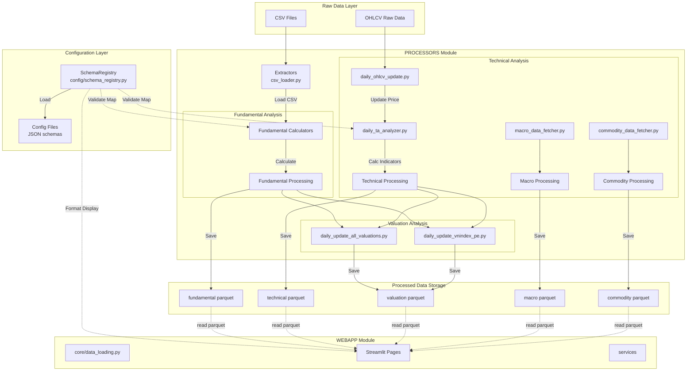

# Phân Tích Kiến Trúc Dòng Chảy Dữ Liệu (Architecture & Data Flow Analysis)

Dưới đây là sơ đồ và phân tích chi tiết về dòng chảy dữ liệu (Data Flow) từ file gốc đến giao diện hiển thị trên Streamlit.

## Sơ Đồ Tổng Quan (High-Level Diagram)

## Chi Tiết Dòng Chảy (Detailed Flow)

### 1. Chuẩn Hóa & Cấu Hình (Standardization & Configuration)
- **Thành phần**: `SchemaRegistry` (`config/schema_registry.py`) và các file JSON trong `config/schemas/`.
- **Vai trò**:
    - **Với Processors**: Cung cấp `metric_registry` để map các mã tài chính (ví dụ: `CBS_270` -> "Tổng tài sản"), `SectorLookup` để phân loại ngành.
    - **Với WebApp**: Cung cấp cấu hình hiển thị (Display Config), định dạng số liệu, màu sắc (Colors) và tên hiển thị tiếng Việt.

### 2. Nguồn Dữ Liệu (Input / Raw Data)
- **Vị trí**: `DATA/raw/` (hoặc các thư mục con tương ứng).
- **Định dạng**: File CSV thô (Raw CSV).
- **Thành phần đọc**: `PROCESSORS/extractors/csv_loader.py` tự động đọc và kiểm tra tính hợp lệ dựa trên các quy tắc từ **SchemaRegistry**.

### 3. Xử Lý & Tính Toán (Processing)

Hệ thống xử lý được chia thành 3 luồng chính trong `PROCESSORS`:

#### A. Phân Tích Cơ Bản (Fundamental)
- **Input**: CSV Báo cáo tài chính.
- **Logic**: Sử dụng `Fundamental Calculators` (Company/Bank/Insurance/Security) để tính toán chỉ số tài chính.
- **Output**: `DATA/processed/fundamental/*.parquet`.

#### B. Kỹ Thuật & Dữ Liệu Thị Trường (Technical & Market)
- **OHLCV**: `daily_ohlcv_update.py` cập nhật dữ liệu giá hàng ngày.
- **Technical Analysis**: `daily_ta_analyzer.py` tính toán các chỉ báo kỹ thuật (RSI, MACD, MA, Bollinger Bands...) từ dữ liệu OHLCV.
- **Macro**: `macro_data_fetcher.py` lấy dữ liệu Vĩ mô (Lãi suất, Tỷ giá...).
- **Commodity**: `commodity_data_fetcher.py` lấy giá Hàng hóa (Dầu, Vàng...).
- **Output**: `DATA/processed/technical/*.parquet`, `macro/*.parquet`, `commodity/*.parquet`.

#### C. Định Giá (Valuation)
- **Input**: Kết hợp dữ liệu Cơ bản (EPS, BVPS) và dữ liệu Giá (Price).
- **Logic**:
    - `daily_update_all_valuations.py`: Tính PE, PB, EV/EBITDA cho từng mã.
    - `daily_update_vnindex_pe.py`: Tính định giá thị trường chung.
- **Output**: `DATA/processed/valuation/*.parquet`.

### 3. Lưu Trữ Dữ Liệu Đã Xử Lý (Final Data Storage)
- **Vị trí**: `DATA/processed/`.
- **Cấu trúc**: Phân chia theo domain.
    - `DATA/processed/fundamental/company_full.parquet`: Dữ liệu đầy đủ cho Doanh nghiệp.
    - `DATA/processed/technical/*.parquet`: Dữ liệu phân tích kỹ thuật.
    - `DATA/processed/valuation/*.parquet`: Dữ liệu định giá.

### 4. Hiển Thị (Streamlit WebApp Display)
- **KHÔNG qua Database Server trung gian**: WebApp đọc **trực tiếp** file Parquet.
- **Cách đọc**: Các trang trong `WEBAPP/pages/` sử dụng `pd.read_parquet` hoặc `duckdb` để truy vấn dữ liệu từ `DATA/processed`.

---

## Phân Tích Chức Năng Chi Tiết Từng Folder (Detailed Folder Analysis)

Dưới đây là mô tả chi tiết nhiệm vụ (tasks) và chức năng của từng folder trong hệ thống:

### A. PROCESSORS (Xử Lý Dữ Liệu)

| Folder Con | Chức Năng Chính | Ghi Chú TaskBoard |
| :--- | :--- | :--- |
| **core/** | Chứa các module cốt lõi dùng chung. | **Task: Core Utils & Logging** - `config`: Quản lý cấu hình chung. - `formatters`: Các hàm định dạng dữ liệu. - `logs`: Cấu hình logging hệ thống. - `validators`: Các hàm kiểm tra dữ liệu đầu vào. |
| **extractors/** | Trích xuất và tải dữ liệu thô. | **Task: Data Ingestion** - `csv_loader.py`: Đọc file CSV, xử lý encoding, làm sạch bước 1. |
| **fundamental/** | Xử lý dữ liệu cơ bản (BCTC). | **Task: Fundamental Analysis** - `calculators/`: Chứa logic tính toán cho từng ngành (Bank, Company...). Đây là nơi chứa "trí tuệ" tài chính. - `formulas/`: Các công thức tài chính phức tạp. |
| **technical/** | Xử lý dữ liệu kỹ thuật. | **Task: Technical Analysis** - `ohlcv/`: Quản lý dữ liệu giá Open-High-Low-Close-Volume. - `indicators/`: Tính toán RSI, MACD, Pivot Points. - `macro/`: Lấy dữ liệu vĩ mô. - `commodity/`: Lấy dữ liệu hàng hóa. |
| **valuation/** | Mô hình định giá. | **Task: Valuation Models** - `calculators/`: Tính PE, PB, Graham number. - `daily_update_*.py`: Script chạy định giá hàng ngày. |
| **pipelines/** | Điều phối quy trình chạy. | **Task: ETL Pipelines** - `daily_update.py`: Pipeline chạy hàng ngày (Technical, Price). - `quarterly_report.py`: Pipeline chạy hàng quý (BCTC). |
| **decision/** | Logic ra quyết định đầu tư. | **Task: Investment Logic** - `valuation_ta_decision.py`: Kết hợp Fundamental + Technical để đưa ra tín hiệu Mua/Bán. |
| **unified/** | Tầng hợp nhất dữ liệu. | **Task: Data Unification** - `unified_data_service.py`: Cung cấp API nội bộ truy cập dữ liệu đa nguồn. - `schema_validator.py`: Đảm bảo dữ liệu tuân thủ schema chung. |
| **forecast/** | Dự báo (AI/ML). | **Task: Forecasting** - Chạy các mô hình dự báo doanh thu/lợi nhuận (nếu có). |
| **news/** | Xử lý tin tức. | **Task: News Processing** - `news_pipeline.py`: Xử lý, phân loại tin tức liên quan đến mã CK. |
| **transformers/** | Biến đổi dữ liệu. | **Task: Data Transformation** - Chuyển đổi định dạng dữ liệu giữa các bước nếu cần thiết (ví dụ: long-to-wide format). |

### B. WEBAPP (Giao Diện Người Dùng)

| Folder Con | Chức Năng Chính | Ghi Chú TaskBoard |
| :--- | :--- | :--- |
| **pages/** | Các trang Dashboard chính. | **Task: UI Pages** - `bank_dashboard.py`: Dashboard Ngân hàng. - `technical_dashboard.py`: Phân tích kỹ thuật. - `forecast_dashboard.py`: Dự báo. (Mỗi file là một View hoàn chỉnh). |
| **core/** | Cấu hình và tiện ích WebApp. | **Task: WebApp Core** - `data_loading.py`: Tối ưu việc load file Parquet (cache). - `display_config.py`: Cấu hình hiển thị bảng biểu. - `symbol_loader.py`: Load danh sách mã CK. |
| **components/** | Thành phần UI tái sử dụng. | **Task: UI Components** - Các widget (bộ lọc, card thông tin) dùng chung cho nhiều trang. |
| **charts/** | Vẽ biểu đồ. | **Task: Visualization** - Chứa các hàm vẽ biểu đồ phức tạp (Plotly/Echarts) tách biệt khỏi logic trang. |
| **services/** | Logic nghiệp vụ WebApp. | **Task: Frontend Services** - `data_service.py`: Cầu nối lấy dữ liệu cho Dashboard. - `llm_service.py`: Tích hợp AI Chatbot. |
| **layout/** | Bố cục trang web. | **Task: Layout Management** - Sidebar, Header, Footer chung. |
| **ai/** | Tích hợp AI/LLM. | **Task: AI Integration** - `prompts.py`: Quản lý câu lệnh Prompt cho AI. - `validators.py`: Kiểm tra đầu ra của AI. |
| **features/** | Tính năng bổ trợ. | **Task: Feature Modules** - `scoring.py`: Tính điểm cổ phiếu. - `signals.py`: Logic hiển thị tín hiệu cảnh báo. |
| **assets/** | Tài nguyên tĩnh. | **Task: Static Assets** - Hình ảnh, CSS, Font. |

### C. CONFIG (Cấu Hình Hệ Thống)

| Folder Con | Chức Năng Chính | Ghi Chú TaskBoard |
| :--- | :--- | :--- |
| **schema_registry.py** | Trung tâm quản lý Schema. | **Task: Schema Management** (Quan trọng nhất) - Load và cung cấp mọi cấu hình hệ thống. |
| **schemas/** | File định nghĩa JSON. | **Task: Config Definitions** - Định nghĩa mappings, format rules, colors. |
| **sector_analysis/** | Cấu hình phân tích ngành. | **Task: Sector Configs** - Định nghĩa trọng số ngành, chỉ số ưu tiên. |

---

## Ghi Chú TaskBoard Hệ Thống (System Taskboard Notes)

Để quản lý dự án hiệu quả, các task trên board nên được ánh xạ theo các folder chức năng này:

1.  **Giai đoạn Ingestion (Data Pipeline)**:
    *   Liên quan: `PROCESSORS/extractors`, `PROCESSORS/pipelines`.
    *   Mục tiêu: Đảm bảo dữ liệu thô vào hệ thống sạch và đúng định dạng.

2.  **Giai đoạn Processing (Core Logic)**:
    *   Liên quan: `PROCESSORS/fundamental`, `PROCESSORS/technical`, `PROCESSORS/valuation`.
    *   Mục tiêu: Tính toán chính xác các chỉ số tài chính/kỹ thuật.

3.  **Giai đoạn Unification (Standardization)**:
    *   Liên quan: `PROCESSORS/unified`, `config/`.
    *   Mục tiêu: Đảm bảo dữ liệu nhất quán, mappable giữa các phân hệ.

4.  **Giai đoạn Presentation (Frontend)**:
    *   Liên quan: `WEBAPP/pages`, `WEBAPP/charts`, `WEBAPP/services`.
    *   Mục tiêu: Hiển thị mượt mà, tốc độ cao (tối ưu `read_parquet`), trải nghiệm người dùng tốt.
