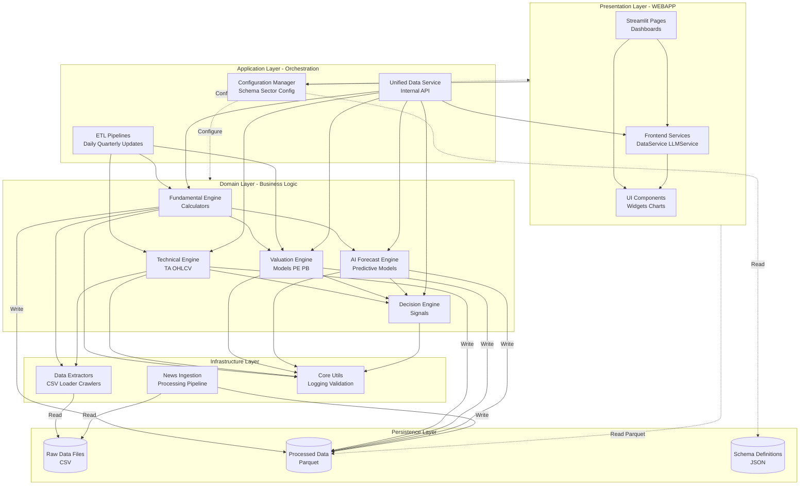

# Kiến Trúc Hệ Thống Phân Lớp (Layered System Architecture)

Tài liệu này mô tả kiến trúc phần mềm của dự án theo mô hình phân lớp (Layered Architecture), giúp hình dung sự phân tách trách nhiệm giữa các module.

## Sơ Đồ Kiến Trúc Tổng Quan (High-Level Architecture)

## Giải Thích Chi Tiết Các Lớp (Layer Descriptions)

### 1. Presentation Layer (Lớp Giao Diện)
- **Trách nhiệm**: Hiển thị dữ liệu, tương tác người dùng.
- **Thành phần**:
    - `WEBAPP/pages`: Các màn hình chính (Bank, Technical, Forecast...).
    - `WEBAPP/components`: Các thành phần giao diện tái sử dụng.
    - `WEBAPP/services`: Xử lý logic hiển thị (ví dụ: gọi LLM để chat).
- **Đặc điểm**: Đọc dữ liệu trực tiếp từ tầng Persistence (Parquet) để tối ưu hiệu năng hiển thị.

### 2. Application Layer (Lớp Ứng Dụng)
- **Trách nhiệm**: Điều phối các quy trình nghiệp vụ, kết nối các module domain.
- **Thành phần**:
    - `PROCESSORS/pipelines`: Chứa các kịch bản chạy định kỳ (Daily, Quarterly). Nó không chứa logic tính toán chi tiết mà chỉ gọi các engine bên dưới.
    - `PROCESSORS/unified`: Cung cấp giao diện truy cập dữ liệu thống nhất cho nội bộ hệ thống.

### 3. Domain Layer (Lớp Nghiệp Vụ - Core)
- **Trách nhiệm**: Chứa toàn bộ "trí tuệ" và logic nghiệp vụ của hệ thống. Đây là nơi giá trị cốt lõi nằm.
- **Thành phần**:
    - **Fundamental Engine**: Các thuật toán tính toán chỉ số tài chính, hiểu biết về bảng cân đối kế toán.
    - **Technical Engine**: Các thuật toán phân tích kỹ thuật, xử lý chuỗi thời gian.
    - **Valuation Engine**: Các mô hình định giá cổ phiếu.
    - **Decision Engine**: Logic kết hợp các tín hiệu để đưa ra khuyến nghị đầu tư.

### 4. Infrastructure Layer (Lớp Hạ Tầng)
- **Trách nhiệm**: Xử lý các vấn đề kỹ thuật cấp thấp, vào/ra dữ liệu.
- **Thành phần**:
    - `PROCESSORS/extractors`: Đọc, làm sạch sơ bộ dữ liệu thô.
    - `PROCESSORS/core`: Các tiện ích dùng chung (Logging, Error Handling).

### 5. Persistence Layer (Lớp Lưu Trữ)
- **Trách nhiệm**: Lưu trữ dữ liệu vật lý.
- **Thành phần**:
    - Hệ thống tập tin (File System) chứa các file `.csv` (Input) và `.parquet` (Output).
    - Hệ thống file cấu hình `.json` (Schema).

---

## Mẫu Thiết Kế (Design Patterns) Đang Sử Dụng

1.  **Template Method**: Sử dụng trong `BaseFinancialCalculator` để định nghĩa khung sườn tính toán, các lớp con (`Bank`, `Company`) chỉ cài đặt logic cụ thể.
2.  **Pipeline Pattern**: Sử dụng trong quy trình cập nhật dữ liệu (`DailyUpdatePipeline`), dữ liệu đi qua một chuỗi các bước xử lý tuần tự.
3.  **Singleton**: Sử dụng cho `SchemaRegistry` để đảm bảo chỉ có một nguồn cấu hình duy nhất trong toàn bộ vòng đời ứng dụng.
4.  **Strategy Pattern** (Implicit): Việc lựa chọn Calculator dựa trên `entity_type` (Bank/Company...) thực chất là một dạng Strategy pattern để thay đổi thuật toán xử lý tùy ngữ cảnh.
